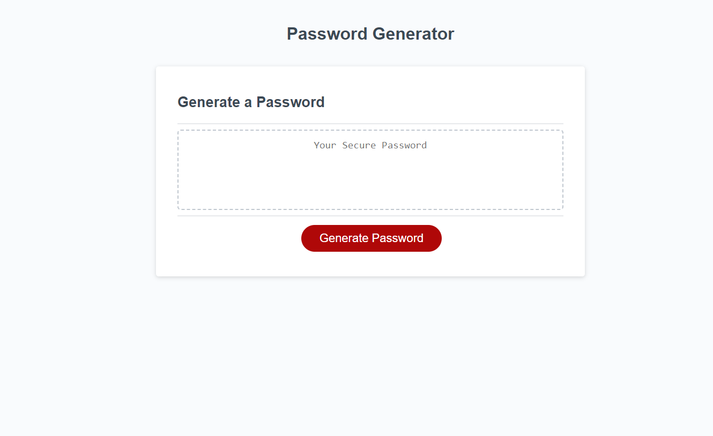

# JavaScript Password Generator

## Description

I modified starter code to create an application that enables employees to generate random passwords based on criteria that they’ve selected. This app will run in the browser and features dynamically updated HTML and CSS powered by JavaScript code.

The password can include special characters from the OWASP (https://www.owasp.org/index.php/Password_special_characters) from the OWASP Foundation.

## Motivation

I wanted to use JavaScript to allow users to creat a secure randomized password that meets criteria provided by the user. The user can select a password between 8 to 128 characters. The user can also decide if they want or need special characters, numeric characters, uppercase characters, or lowercase characters included within their randomized password.

## Comments

I have added comments to more easily understand the JavaScript code that I added to perform all requested features asked to be included. 

## Screenshot

## Link to Application

https://jcgilbert70.github.io/password-generator/

## Link to Repository

https://github.com/jcgilbert70/password-generator.git

## Credits

N/A

## License

Please refer to the LISCENSE in the repo